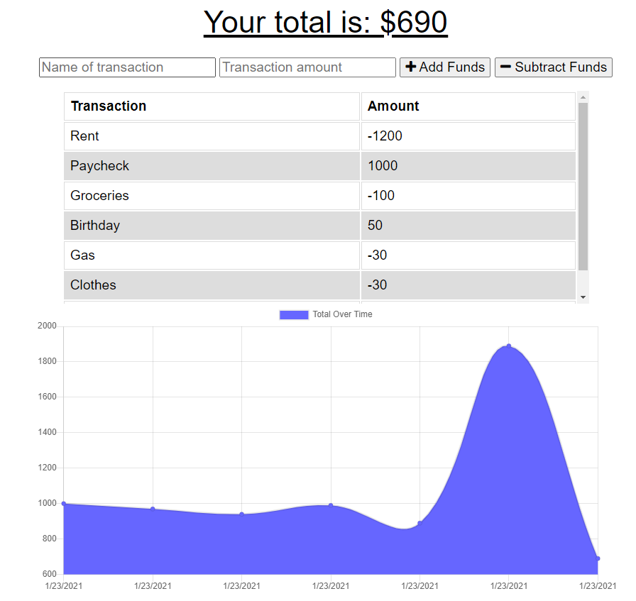
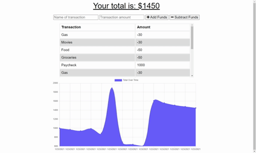

# Online/Offline Budget Tracker

Keep track of your budget and expenses while on the go! 

## Table of Contents

1. [Usage](#Usage)
1. [Languages and Concepts](#Languages-and-Concepts)
1. [Demo](#Demo)
1. [Roadmap](#Roadmap)
1. [Links](#Links)
1. [Contact](#Contact)
1. [Contributing](#Contributing)
1. [License](#License)

## Usage

This application is a budget tracker where the user can input their income and expenses while on the go. No need to worry about losing internet connection, thanks to the app's offline access!

## Languages and Concepts

- [IndexedDB](https://developer.mozilla.org/en-US/docs/Web/API/IndexedDB_API)
- [Service Workers](https://developer.mozilla.org/en-US/docs/Web/API/Service_Worker_API)
- [Web Manifest](https://developer.mozilla.org/en-US/docs/Web/Manifest)
- [MongoDB](https://www.mongodb.com/)
- [Mongoose](https://mongoosejs.com/)
- [Morgan](https://www.npmjs.com/package/morgan)
- [Node.js](https://nodejs.org/en/)
- [Express.js](https://expressjs.com/)

## Demo

## Roadmap

To further this project, I would like to add filters and categories to make this app more customizable. I would like the user to be able to view by a date range or by income/expense or by the type of transaction. I would also like to explore a budget planner, either a separate page or a separate function, where the user could forecast what their spending may be like. I would also like to add the ability to edit and delete transactions.

## Links

- [See it live](https://sheltered-woodland-39381.herokuapp.com/)
- [Project Repository](https://github.com/ncmarsh/online_offline_budget_tracker)

## Contact

- Nicole Marshall - [@ncmarsh](https://github.com/ncmarsh)

## Contributing

This is a personal project; no contributions are required at this time.

## License

No license granted.

##### [Return to Top of Page](#Online/Offline-Budget-Tracker)